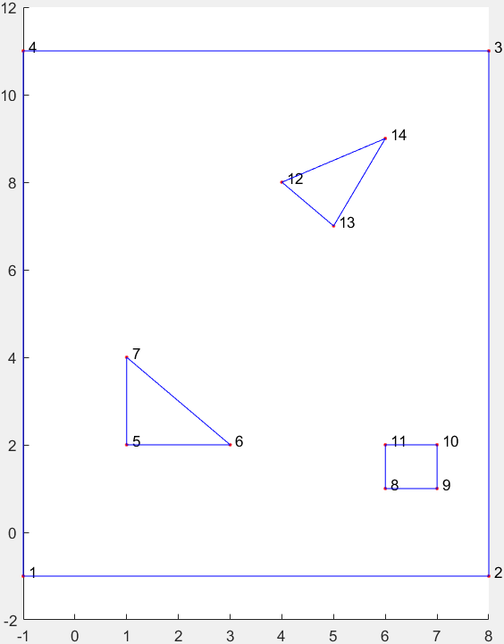
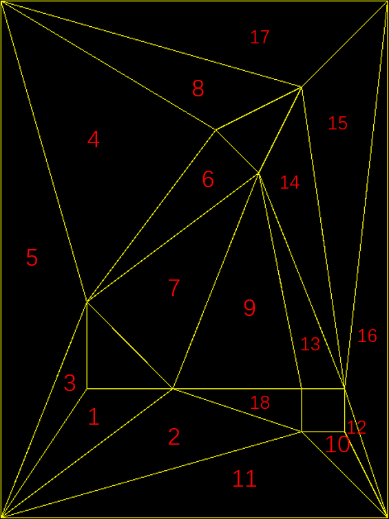

Triangulation-Based_Pathfinding
========
三角剖分A*寻路

Pathfinding based on triangulation and A* algorithm

算法原理
========
* 通过三角剖分将连续平面转换为三角网格，用到了开源库 [Triangle](http://www.cs.cmu.edu/~quake/triangle.html)
* 在三角网格上通过A*算法，找到从起点到终点经过的三角网格路径
* 在三角网格路径上应用漏斗算法，求得从起点到终点的最短路径

使用说明
=======
1. 函数介绍
--------
* `map2poly` 将输入文件转换为.poly文件
* `funnel` 用漏斗算法，求出三角网格路径上起点到终点的最短路径
* `readpoly` 读取.poly，构造三角网格的邻接表，并用A*算法和漏斗算法计算最短路径

2. 示例
--------

test.txt

    3           # 障碍的个数
    -1 -1       # 地图边界为(-1,1)~(8,11)
    8 11
    3           # 第1个障碍边界点的个数
    1 2         # 障碍边界点(1,2)
    3 2
    1 4
    4
    6 1
    7 1
    7 2
    6 2
    3
    4 8
    5 7
    6 9

    1.5 3       # 每个障碍内部取1点
    6.5 1.5
    5 8

输出:

    map:
    1: 2 3
    2: 1 11 18
    3: 1 5
    4: 5 6 8
    5: 3 4
    6: 4 7
    7: 6 9
    8: 4 17
    9: 7 13 18
    10: 11 12
    11: 2 10
    12: 10 16
    13: 9 14
    14: 13 15
    15: 14 16 17
    16: 12 15
    17: 8 15
    18: 2 9
    start triangle:1
    end triangle:15

    path triangle:
    1->3->5->4->8->17->15

    path point:
    (0.000,0.000) (1.000,4.000) (4.000,8.000) (7.000,10.000)

    distance:12.728657

